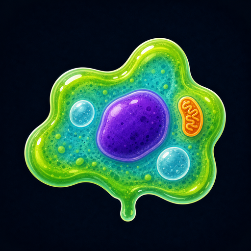
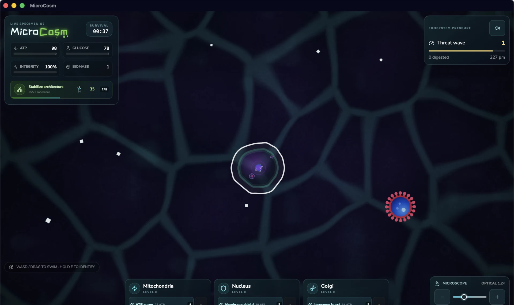
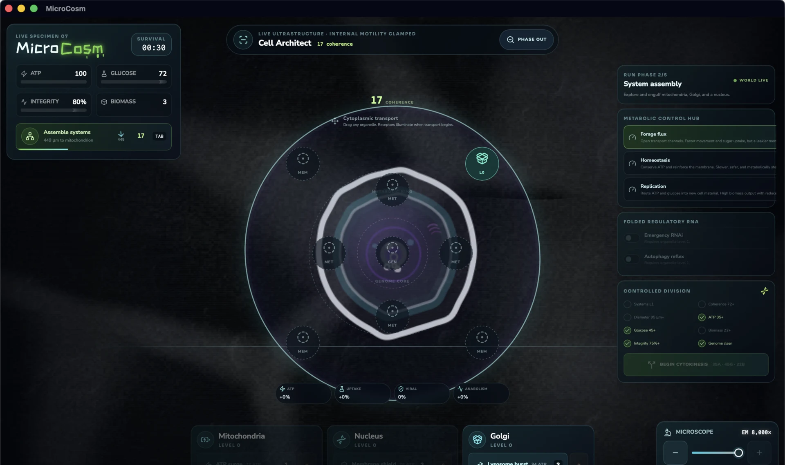

<div align="center">
  

# MicroCosm

### Survive the ecosystem. Engineer the cell. Divide before it consumes you.

An experimental real-time cellular survival strategy game for desktop and browser.


</div>



## One cell, two games

MicroCosm runs two interdependent game loops at once. Every decision inside the cell changes how well it survives outside, while every resource gathered outside determines what can be built within.

| Ecosystem survival | Cellular strategy |
| --- | --- |
| Swim through a borderless, procedurally streamed micro-world | Build a functional internal architecture around the genome |
| Hunt white glucose crystals and engulf useful organelles | Place and rearrange mitochondria, nuclei, and Golgi systems |
| Evade predators, armored organisms, fungal barriers, and viruses | Balance ATP generation, uptake, repair, biomass, and viral resistance |
| Read currents, threats, scale, and spatial opportunities in real time | Switch metabolic stances and fold regulatory RNA programs |

The world does not pause while the cell is being redesigned. Survival and architecture remain part of the same continuous simulation.

## The run

A successful specimen progresses through five biological phases:

1. **Ignite metabolism** by gathering glucose and establishing ATP production.
2. **Assemble systems** by engulfing the organelles needed for a viable cell.
3. **Stabilize architecture** by placing those systems into a coherent internal plan.
4. **Build replication reserves** while preserving membrane integrity and genome stability.
5. **Begin cytokinesis** and survive the division process in real time.

Genome hijack is not simply a damage timer. An upgraded nucleus enables RNA interference, while an upgraded Golgi apparatus enables autophagy. Either route can suppress viral replication, and regulatory RNA can automate emergency responses at an ongoing metabolic cost.

## Cell Architect



Push the microscope into ultrastructure and the external world phases into the living cell plan. Organelles can be dragged between illuminated genome, metabolic, and membrane receptors. Position affects ATP flux, transport, anabolism, movement, lysosome reach, architecture coherence, and viral resistance.

Three metabolic stances let the same cell behave very differently:

- **Forage Flux** opens transport channels for speed and rapid sugar uptake, at the cost of a leakier membrane.
- **Homeostasis** conserves ATP and reinforces the membrane for a slower, safer organism.
- **Replication** routes resources into biomass and new cell material while reducing mobility.

## Microscopy as a mechanic

The microscope is more than a camera zoom. At ecosystem scale the game uses a vivid illustrated cellular language. Increasing magnification progressively strips away color and introduces granular electron-micrograph structure. At maximum magnification, exploration gives way to direct manipulation of the cell interior.

## Controls

| Input | Action |
| --- | --- |
| <kbd>W</kbd> <kbd>A</kbd> <kbd>S</kbd> <kbd>D</kbd> or arrow keys | Swim |
| Drag or tap the world | Steer toward the pointer |
| <kbd>[</kbd> / <kbd>]</kbd> | Zoom the microscope out / in |
| Microscope slider | Move between ecosystem and ultrastructure |
| <kbd>Tab</kbd> | Enter or leave Cell Architect when available |
| Hold <kbd>E</kbd> | Identify nearby biological structures |
| <kbd>1</kbd> <kbd>2</kbd> <kbd>3</kbd> | Trigger organelle abilities |
| Mouse or touch drag | Reposition organelles in Cell Architect |

## Core systems

- Deterministic infinite-world chunk streaming with no invisible arena borders
- Real-time glucose, ATP, biomass, integrity, and size economy
- Organism-specific behavior, collision profiles, weak points, and predation rules
- Placeable and upgradeable organelles with layout-dependent bonuses
- Active abilities including ATP Surge, Membrane Shield, and Lysosome Burst
- Viral attachment, genome hijack, RNA interference, and autophagy responses
- Continuous five-phase objective structure with controlled division as the win condition
- Optical-to-electron microscope transition integrated into play
- Mouse, keyboard, touch, browser, and native desktop support
- Local simulation with no account, Firebase, or server dependency

## Run locally

### Requirements

- [Bun](https://bun.sh/)
- A current Rust toolchain for native builds
- The platform prerequisites required by [Tauri 2](https://tauri.app/start/prerequisites/)

### Browser

```bash
bun install
bun run dev
```

Vite prints the local and network addresses. The responsive client can also be opened from a mobile browser on the same network.

### Native desktop

```bash
bun tauri dev
```

### Production build

```bash
bun tauri build
```

Native bundles are written beneath `src-tauri/target/release/bundle/`.

## Quality checks

```bash
bun test
bun run typecheck
bun run lint
bun run build
```

## Technology

| Layer | Stack |
| --- | --- |
| Simulation and interface | React 18 + TypeScript |
| Build system | Vite 7 + Bun |
| Native shell | Tauri 2 + Rust |
| Styling | Tailwind CSS + project-specific CSS |
| Spatial generation | D3 Delaunay + deterministic chunk generation |
| Interface primitives | Radix UI + Lucide |
| Persistence and services | Fully local, no backend required |

## Project structure

```text
MicroCosm/
├── src/                  # Game simulation, rendering, UI, and tests
├── public/assets/        # Microscopy textures and runtime artwork
├── docs/screenshots/     # README showcase images
├── src-tauri/            # Native application shell and platform icons
├── package.json          # Bun scripts and frontend dependencies
└── vite.config.ts        # Vite development and production configuration
```

## Project status

MicroCosm is an actively developed experimental game. The complete run structure and dual gameplay loop are playable, while balancing, biological variety, accessibility, mobile packaging, performance, and visual feedback continue to evolve.

<div align="center">
  <sub>Built for people who look at a cell and see both an organism and a factory.</sub>
</div>
