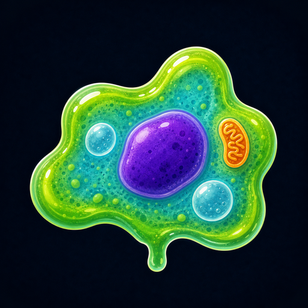
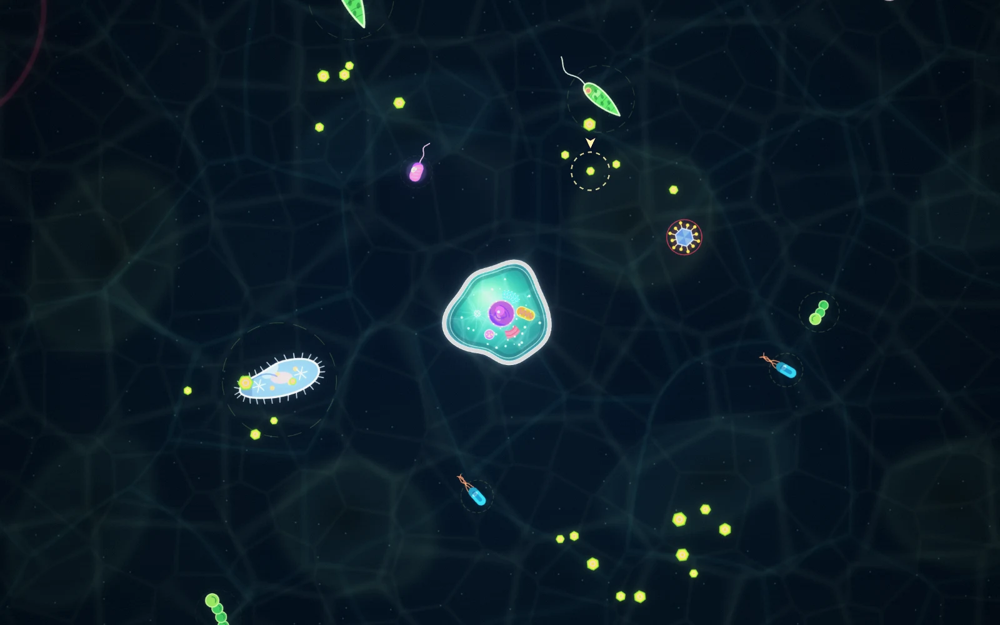
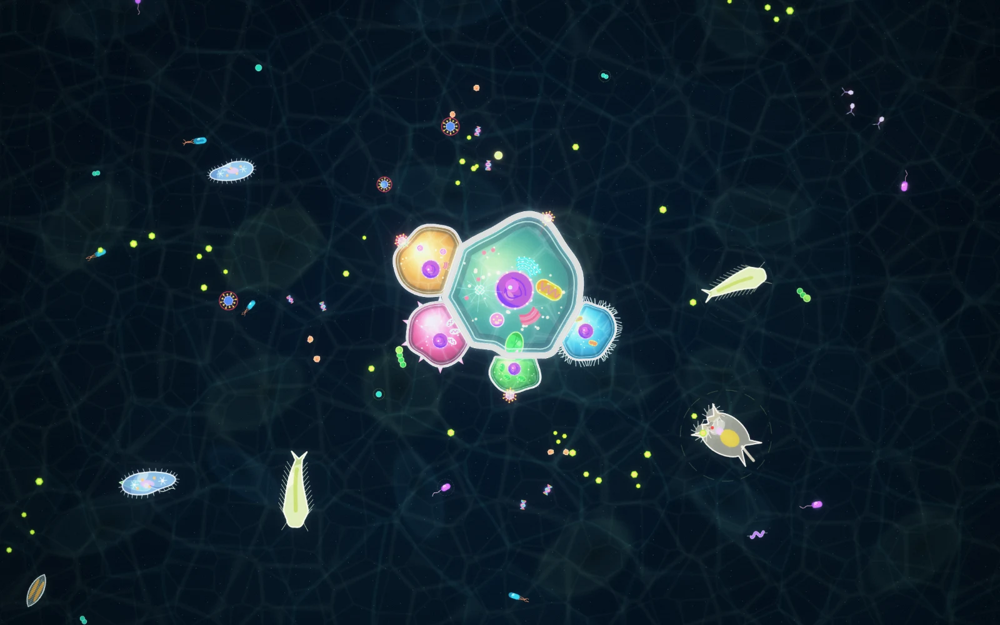
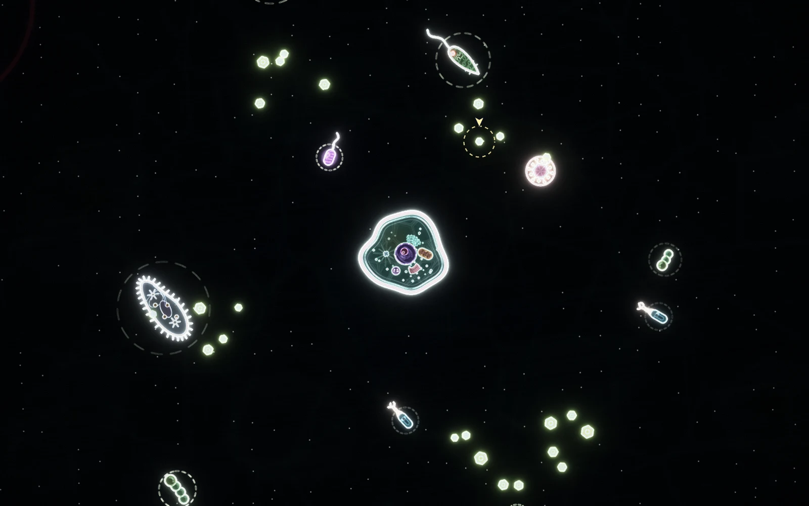
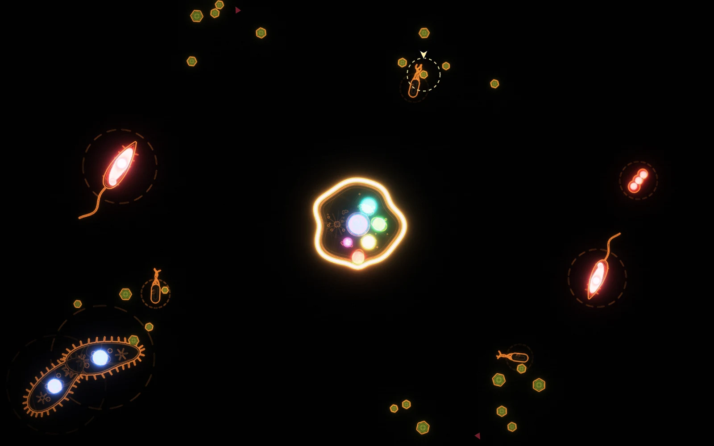
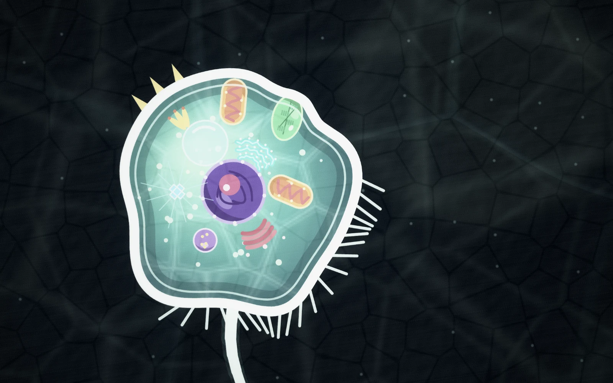

<div align="center">
  

# MicroCosm

### Engulf. Endosymbiose. Divide. Become multicellular.

A real-time cellular survival game for desktop and browser: part agar.io, part Factorio-inside-a-cell, part *Journey to the Microcosmos*, drawn in a Kurzgesagt-style flat palette.


</div>



## The run

You begin as a single amoeboid cell in an infinite, procedurally streamed drop of pond water. The arc follows the real history of complex life:

1. **Ignite metabolism.** Swim into glucose crystals. Glycolysis turns each into ATP.
2. **Endosymbiosis.** Engulf a purple α-proteobacterium and keep it: it becomes your first mitochondrion, and ATP output jumps. Engulf a cyanobacterium and you gain a chloroplast instead.
3. **Build the cell.** Digested prey becomes biomass. Zoom into your ultrastructure and grow an endoplasmic reticulum, Golgi, lysosomes, flagella, cilia, extrusomes and more.
4. **Divide.** At critical mass, replicate your genome (it costs DNA) and pinch in two. The daughter stays attached, and you choose its fate and a heritable mutation.
5. **Multicellularity.** Grow a colony of six specialized cells: photocytes, ciliocytes, phagocytes, cnidocytes and germ cells, tessellated like tissue.



## A living ecosystem

Thirty-three species, each with its own behavior and a Field Journal entry grounded in real biology. They hunt, flee, graze and infect each other without you.

| | Organisms |
| --- | --- |
| **Food** | Glucose, cell debris, DNA fragments, lipid droplets, cocci, bacilli, spirilla, diatoms, Euglena, gastrotrichs |
| **Endosymbionts** | α-proteobacteria (→ mitochondria), cyanobacteria (→ chloroplasts) |
| **Hunters** | *Didinium* charges, *Lacrymaria olor* coils its neck and strikes, *Amoeba proteus* engulfs anything smaller, *Paramecium* fires trichocysts |
| **Traps** | Hydra tentacles with nematocysts, the near-invisible *Collotheca* funnel, Stentor and rotifer feeding vortices |
| **Armor and terrain** | *Arcella* (only its aperture is vulnerable), indestructible tardigrades (brush them for Dsup protection), pollen grains |
| **Mini-boss** | Neoplasms: glucose-hoarding tumor masses that split when wounded |

Infection follows the design bible's **aliveness spectrum**:

| Agent | Mechanic |
| --- | --- |
| Prions | Misfold an organelle; the misfolding spreads to neighbors. A lysosome burst performs autophagy. |
| Viroids | Swarm photosynthetic cells and siphon ATP. Shake them off. |
| Satellite RNAs | Inert alone; amplify the next virus that infects you. |
| Viruses | Adenovirus (lytic), retrovirus (integrates as a dormant provirus that stress can reawaken), TMV (plant cells only), bacteriophage (bacteria only), Mimivirus (amoebae, including you). Docked virions can be shaken off with a dash before they inject. |
| Virophages | Allies. Absorb them and release the swarm against giant viruses. |
| Intracellular bacteria | Hitchhike inside infected prey and colonize your cytoplasm. |

Five biomes (Sunlit Shallows, Biofilm Reef, Lysis Bloom, Abyssal Sediment, Neoplastic Rift) set light for photosynthesis, glucose density, currents and spawn tables. An ecosystem director escalates pressure with time, distance and generation: viral storms, prion fog, phage bursts, glucose blooms, current surges and neoplasm hunts.

## The microscope is a mechanic

Press <kbd>Q</kbd> to switch illumination. Each light shows different things.

| Darkfield | Fluorescence |
| --- | --- |
|  |  |
| Scattered light outlines every edge on a black field. Reveals transparent agents (prions, viroids, satellites) and the bristles of traps. | Real probe colors: DAPI-blue nuclei, MitoTracker-green mitochondria, red chlorophyll, magenta lysosomes, orange membrane dye. Reveals infected prey and proviruses, but excitation light costs ATP (phototoxicity). |

Brightfield is the vivid illustrated default. Zooming into the **Cell Architect** shifts the grade toward an electron micrograph.

## Cell Architect



Press <kbd>TAB</kbd> to zoom into your own ultrastructure. Time slows but never stops. Drag organelles between genome, cytoplasm and cortex slots. Placement creates synergies, for example:

- ER beside the nucleus makes construction cheaper.
- Golgi fed by ER strengthens lysosome bursts and darts.
- Mitochondria next to a flagellum, cilia or cytoskeleton boost speed.
- Chloroplasts in the cortex catch more light.

Your cell's size follows from what it contains: every organelle is real biomass the membrane has to wrap.

## Controls

| Input | Action |
| --- | --- |
| <kbd>W</kbd><kbd>A</kbd><kbd>S</kbd><kbd>D</kbd> / arrows, or hold the mouse | Swim |
| <kbd>Space</kbd> | Pseudopod dash: shakes off docked viruses, breaks grips |
| <kbd>1</kbd>–<kbd>5</kbd>, right click | Lysosome burst, toxicyst volley, RNA interference, encyst, release virophages |
| <kbd>Q</kbd> | Cycle brightfield, darkfield and fluorescence |
| <kbd>Tab</kbd> | Cell Architect |
| <kbd>R</kbd> | Divide |
| Hold <kbd>E</kbd> | Identify specimens |
| Mouse wheel, <kbd>[</kbd> <kbd>]</kbd> | Magnification |
| <kbd>Esc</kbd> | Pause (also automatic when the window loses focus) |

## Under the hood

- **Simulation** (`src/game/sim`): plain, deterministic TypeScript with no DOM. Seeded chunk streaming, a spatial hash, behavior AI, combat, infection, metabolism and division. A full world step costs well under a millisecond.
- **Membrane**: a ring of springy radii at fixed angles. It is star-shaped by construction, so it can never self-intersect on a hard turn (the old "180° cell wall" bug), yet it still forms pseudopods, organelle bulges, a phagocytic cup around prey, and flat shared walls between colony cells.
- **Renderer** (`src/game/render`): every organism is drawn procedurally on a Canvas2D layer, plus a half-resolution emissive layer. A WebGL2 stack composes a biome-tinted, flow-warped Voronoi field with the scene, applies the microscope light modes, then bloom (13-tap downsample, tent upsample), shockwave distortion, chromatic aberration, vignette and grain. Resolution adapts automatically when frames run long.
- **Audio** (`src/game/audio.ts`): fully synthesized with Web Audio. An adaptive filtered-noise wash, granular grains, a Markov-chain melody over biome-specific modes on FM bells, a threat heartbeat, and around 30 effects. There are no audio files.
- **UI** (`src/ui`): React for the HUD and menus only. The engine publishes snapshots through a tiny external store, and React never runs in the frame loop. Journal and build-menu thumbnails are rendered by the same drawing code as the world.
- **Persistence**: local only (Field Journal, personal records, settings).

## Run locally

Requires [Bun](https://bun.sh/). Native builds also need a Rust toolchain and the [Tauri 2 prerequisites](https://tauri.app/start/prerequisites/).

```bash
bun install
bun run dev        # browser, http://localhost:1420
bun tauri dev      # native desktop window
bun tauri build    # native bundles in src-tauri/target/release/bundle/
```

Append `?seed=1234` to the URL to replay a specific world.

## Quality checks

```bash
bun test           # simulation invariants + a full deterministic playthrough by a scripted bot
bun run typecheck
bun run lint
bun run build
```

`tests/bot.ts` is a scripted "naturalist" that plays complete runs headlessly. It is useful for balance tuning across many seeds.

## Project structure

```text
src/
├── game/
│   ├── sim/        # deterministic simulation: species, biomes, organelles, AI, infection, division
│   ├── render/     # Canvas2D organism art, WebGL2 post-processing, particles, camera, overlay
│   ├── audio.ts    # procedural soundscape
│   ├── engine.ts   # single frame loop: input → step → render → feedback → HUD snapshot
│   └── ...         # input, store, persistence
├── ui/             # React HUD, Cell Architect, journal, menus, styles
tests/              # bun tests and the playtest bot
src-tauri/          # native shell
media/              # design references and legacy art
```
